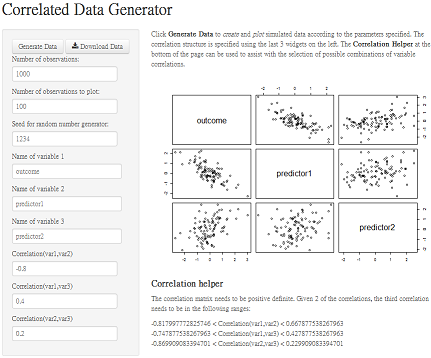
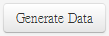
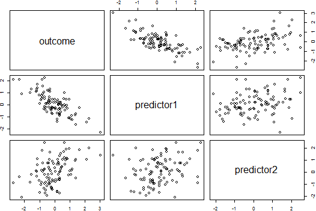
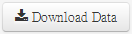
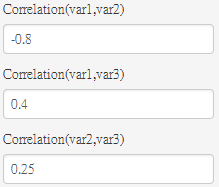
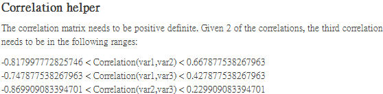

---
title       : Correlated Data Generator
subtitle    : Coursera Developing Data Products Pitch Deck
author      : Derek Ploor
job         : 
framework   : io2012        # {io2012, html5slides, shower, dzslides, ...}
highlighter : highlight.js  # {highlight.js, prettify, highlight}
hitheme     : tomorrow      # 
widgets     : [mathjax]            # {mathjax, quiz, bootstrap}
mode        : selfcontained # {standalone, draft}
knit        : slidify::knit2slides
---  &twocol

## Description of the App

*** =left

- Purpose: To generate simulated datasets of 3 variables for a given correlation structure
- Features:
    - Control of number of records, variable names, and correlation structure
    - Can download simulated data as a CSV file
    - Can view a plot of the data
    - User can set the random number generator seed, for reproducibility
- Basic logic for the data generation can be found at this [R-blogger post](http://www.r-bloggers.com/simulating-random-multivariate-correlated-data-continuous-variables/ "Simulating Random Multivariate Correlated Data (Continuous Variables)").

*** =right
- The app is deployed at [http://ploor.shinyapps.io/DDPShinyApp/](http://ploor.shinyapps.io/DDPShinyApp/)


---  &twocol

## Data Generation Example

*** =left

Input the following into the widgets:


*** =right

Click , and a sampled plot of the data will display:



--- .class #id 

## Downloading data and loading into R

Click on , save the CSV file to your R working directory as `data.csv` (or another name).   The file can be easily read with R:


```r
data <- read.csv("data.csv")
cor(data)
```

```
##            outcome predictor1 predictor2
## outcome     1.0000    -0.7926     0.3893
## predictor1 -0.7926     1.0000     0.2210
## predictor2  0.3893     0.2210     1.0000
```

Notice how
- correlation between `outcome` and `predictor1` is close to the `-0.8` we specified
- correlation between `outcome` and `predictor2` is close to the `0.4` we specified
- correlation between `predictor1` and `predictor2` is close to the `0.2` we specified


---  &twocol

## Correlation structure

*** =left
Configurations such as the following will lead to an error:


<!--```{r, echo=FALSE}
chol(matrix(cbind(1,-.80,.4,  -.80,1,.25,  .4,.25,1),nrow=3))
```-->

This is because the following correlation matrix needs to be positive definite:
$$
\left(\begin{array}{@{}ccc@{}}
                    1 & r_{12} & r_{13} \\
                    r_{12} & 1 & r_{23} \\
                    r_{13} & r_{23} & 1
                  \end{array}\right)
$$

*** =right

The correlation matrix will be positive definite if, for example, $r_{23}$ is in the following range:
$$
\begin{align*}
r_{12}r_{13}-&\sqrt{(1-r^2_{12})(1-r^2_{13})} \\
\le &r_{23} \le \\
r_{12}r_{13}&+\sqrt{(1-r^2_{12})(1-r^2_{13})}
\end{align*}
$$

The Shiny App assists in selecting valid combinations of correlations by reactively displaying the following output:

